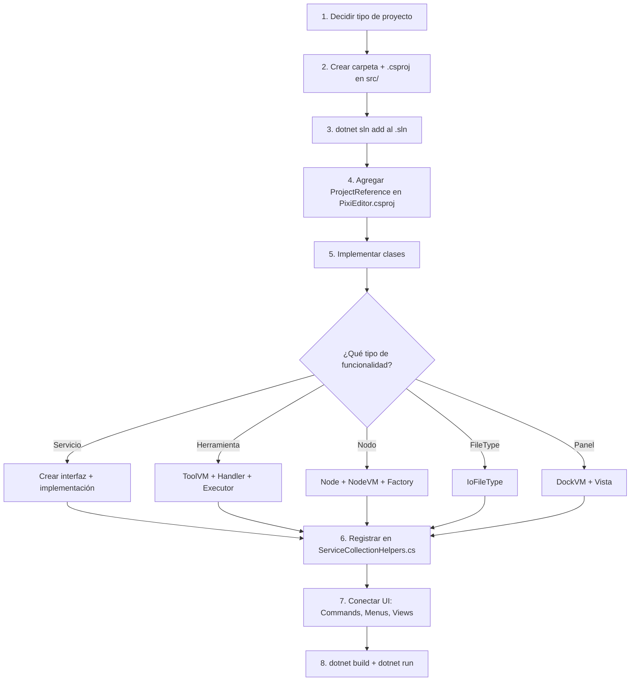

# Guía: Crear una nueva funcionalidad y agregarla a PixiEditor (YTB-Art)

## TL;DR — Resumen del proceso

```
1. Decidir tipo de proyecto → casi siempre Class Library (.NET 8)
2. Crear carpeta + .csproj en src/
3. Agregar al .sln
4. Referenciar desde los proyectos que lo necesiten
5. Crear clases (ViewModels, Servicios, Nodos, etc.)
6. Registrar en ServiceCollectionHelpers.cs (DI)
7. Conectar con la UI (Views, Menus, Comandos)
8. Compilar y probar
```

---

## Paso 1: Decidir el tipo de proyecto

> [!IMPORTANT]
> El 95% de las funcionalidades nuevas deben ser **Class Library** (`net8.0`). Solo usa otros tipos en casos especiales.

### Tabla de decisión

| Quiero crear... | Tipo de proyecto | SDK |
|---|---|---|
| **Lógica de negocio / servicios** (filtros, parsers, IO, etc.) | Class Library | `Microsoft.NET.Sdk` |
| **UI / controles Avalonia** (paneles, diálogos, overlays) | Class Library (con Avalonia) | `Microsoft.NET.Sdk` |
| **Herramienta de línea de comandos** (empaquetador, generador) | Console Application | `Microsoft.NET.Sdk` |
| **Tarea MSBuild** (generadores de build) | Class Library | `Microsoft.NET.Sdk` |
| **Source Generator** (generación de código en compilación) | Class Library (netstandard2.0) | `Microsoft.NET.Sdk` |
| **Extensión WASM** (plugin de usuario) | Class Library (WASI target) | `Microsoft.NET.Sdk` + SDK Extensions |

### ¿Cuándo NO crear un nuevo proyecto?

Si la funcionalidad es:
- Un solo archivo o clase pequeña → agrégala al proyecto existente más cercano
- Un comando / menú / preferencia → va directamente en `src/PixiEditor/`
- Un nodo nuevo → va en `src/PixiEditor.ChangeableDocument/`
- Un control UI reutilizable → va en `src/PixiEditor.UI.Common/`

### Regla general

Crea un proyecto nuevo solo cuando:
1. La funcionalidad es **reutilizable** por varios proyectos
2. Quieres **aislar dependencias** (ej: no quieres que todo PixiEditor dependa de FFmpeg)
3. El módulo tiene su propio **ciclo de vida** o es **opcional**

---

## Paso 2: Crear el proyecto

### 2.1 Crear la carpeta

La convención de nombres del proyecto es:
```
src/PixiEditor.{NombreModulo}/
```

Ejemplo: si quieres crear un módulo de "AI Filters":
```
src/PixiEditor.AiFilters/
```

### 2.2 Crear el archivo `.csproj`

> [!TIP]
> Copia un `.csproj` existente similar al tuyo y modifícalo. Los más simples para tomar como base son:
> - [PixiEditor.Common.csproj](file:///c:/YTBEngine/YTB-Art/src/PixiEditor.Common/PixiEditor.Common.csproj) — mínimo, sin dependencias
> - [PixiEditor.SVG.csproj](file:///c:/YTBEngine/YTB-Art/src/PixiEditor.SVG/PixiEditor.SVG.csproj) — con referencias a Drawie

#### Template mínimo de Class Library:

```xml
<Project Sdk="Microsoft.NET.Sdk">

    <PropertyGroup>
        <TargetFramework>net8.0</TargetFramework>
        <ImplicitUsings>enable</ImplicitUsings>
        <Nullable>enable</Nullable>
        <RootNamespace>PixiEditor.AiFilters</RootNamespace>
    </PropertyGroup>

    <!-- Referencias a otros proyectos de la solución -->
    <ItemGroup>
      <ProjectReference Include="..\PixiEditor.Common\PixiEditor.Common.csproj" />
      <!-- Agrega las que necesites -->
    </ItemGroup>

    <!-- Paquetes NuGet externos -->
    <ItemGroup>
      <!-- <PackageReference Include="NombrePaquete" Version="X.Y.Z" /> -->
    </ItemGroup>

</Project>
```

#### Template con UI Avalonia:

```xml
<Project Sdk="Microsoft.NET.Sdk">

    <PropertyGroup>
        <TargetFramework>net8.0</TargetFramework>
        <ImplicitUsings>enable</ImplicitUsings>
        <Nullable>enable</Nullable>
        <RootNamespace>PixiEditor.MiModuloUI</RootNamespace>
    </PropertyGroup>

    <ItemGroup>
        <PackageReference Include="Avalonia" Version="$(AvaloniaVersion)" />
        <PackageReference Include="CommunityToolkit.Mvvm" Version="8.4.0" />
    </ItemGroup>

    <ItemGroup>
      <ProjectReference Include="..\PixiEditor.Common\PixiEditor.Common.csproj" />
    </ItemGroup>

</Project>
```

> [!NOTE]
> `$(AvaloniaVersion)` se define en [Directory.Build.props](file:///c:/YTBEngine/YTB-Art/src/Directory.Build.props) como `11.3.12-cibuild0004211-alpha`. Todos los proyectos de la solución heredan esta variable automáticamente.

#### Template de Console Application (herramienta de build):

```xml
<Project Sdk="Microsoft.NET.Sdk">

    <PropertyGroup>
        <OutputType>Exe</OutputType>
        <TargetFramework>net8.0</TargetFramework>
        <ImplicitUsings>enable</ImplicitUsings>
        <Nullable>enable</Nullable>
    </PropertyGroup>

</Project>
```

---

## Paso 3: Agregar al archivo de solución (.sln)

```powershell
cd c:\YTBEngine\YTB-Art\src
dotnet sln PixiEditor.sln add PixiEditor.AiFilters\PixiEditor.AiFilters.csproj
```

Esto registra el proyecto en la solución para que Visual Studio / Rider lo reconozcan.

---

## Paso 4: Agregar la referencia desde PixiEditor

Para que el proyecto principal (`src/PixiEditor/`) use tu nuevo módulo, agrega la referencia en [PixiEditor.csproj](file:///c:/YTBEngine/YTB-Art/src/PixiEditor/PixiEditor.csproj):

```xml
<!-- En el ItemGroup de ProjectReferences (línea ~113) -->
<ProjectReference Include="..\PixiEditor.AiFilters\PixiEditor.AiFilters.csproj"/>
```

### Diagrama de dependencias

```
Tu nuevo proyecto tiene que encajar en la jerarquía existente:

PixiEditor.Desktop (ejecutable)
    └── PixiEditor (UI + MVVM)
         ├── PixiEditor.AiFilters  ← TU NUEVO MÓDULO
         ├── PixiEditor.ChangeableDocument
         ├── ChunkyImageLib
         ├── PixiEditor.SVG
         ├── PixiEditor.Extensions.*
         ├── PixiEditor.UI.Common
         ├── Drawie.*
         └── PixiParser.*
```

> [!WARNING]
> **No crees dependencias circulares.** Tu módulo puede depender de `PixiEditor.Common`, `Drawie`, `ChunkyImageLib`, etc. Pero `PixiEditor.Common` NO puede depender de tu módulo. Respeta la jerarquía de dependencias.

---

## Paso 5: Implementar la funcionalidad

Dependiendo de **qué tipo** de funcionalidad estés creando, el patrón varía. Aquí los escenarios más comunes:

---

### Escenario A: Un servicio o lógica de negocio

**Ejemplo:** un servicio que aplica filtros AI a imágenes.

```
src/PixiEditor.AiFilters/
├── PixiEditor.AiFilters.csproj
├── IAiFilterService.cs          ← interfaz pública
├── AiFilterService.cs           ← implementación
└── Models/
    ├── FilterResult.cs
    └── FilterOptions.cs
```

```csharp
// IAiFilterService.cs
namespace PixiEditor.AiFilters;

public interface IAiFilterService
{
    Task<FilterResult> ApplyFilterAsync(byte[] imageData, FilterOptions options);
}
```

**Registrar en DI** → en [ServiceCollectionHelpers.cs](file:///c:/YTBEngine/YTB-Art/src/PixiEditor/Helpers/ServiceCollectionHelpers.cs):

```csharp
// Dentro del método AddPixiEditor(), agregar:
.AddSingleton<IAiFilterService, AiFilterService>()
```

---

### Escenario B: Una herramienta nueva

Sigue los pasos del documento [04-herramientas.md](file:///c:/YTBEngine/YTB-Art/docs/04-herramientas.md):

1. **ToolViewModel** en `PixiEditor/ViewModels/Tools/Tools/`
2. **Handler interface** en `PixiEditor/Models/Handlers/Tools/`
3. **Registrar en DI** con `.AddTool<IHandler, ViewModel>()`
4. **Executor** en `Models/DocumentModels/UpdateableChangeExecutors/`
5. **Overlay** (opcional) en `Views/Overlays/`

---

### Escenario C: Un nodo nuevo para el grafo

Sigue los pasos del documento [03-grafo-de-nodos.md](file:///c:/YTBEngine/YTB-Art/docs/03-grafo-de-nodos.md):

1. **Nodo** en `ChangeableDocument/Changeables/Graph/Nodes/`
2. **NodeViewModel** en `PixiEditor/ViewModels/Document/Nodes/`
3. **SerializationFactory** en `PixiEditor/Models/Serialization/Factories/`

---

### Escenario D: Un tipo de archivo nuevo

1. **Clase IoFileType** en `PixiEditor/Models/Files/`
2. **Registrar** con `.AddSingleton<IoFileType, TuTipoDeArchivo>()`

---

### Escenario E: Un panel acoplable nuevo (Dockable)

1. **DockViewModel** en `PixiEditor/ViewModels/Dock/`
2. **Vista** en `PixiEditor/Views/Dock/`
3. Registrar en **LayoutManager**

---

## Paso 6: Registrar en DI (Inyección de Dependencias)

> [!IMPORTANT]
> **Todo** se registra en [ServiceCollectionHelpers.cs](file:///c:/YTBEngine/YTB-Art/src/PixiEditor/Helpers/ServiceCollectionHelpers.cs). Este es el archivo central de registro DI.

### Patrón de registro según tipo

```csharp
// === Servicio simple ===
.AddSingleton<IMiServicio, MiServicio>()

// === ViewModel ===
.AddSingleton<MiSubViewModel>()

// === Herramienta ===
.AddTool<IMiToolHandler, MiToolViewModel>()

// === Tipo de archivo ===
.AddSingleton<IoFileType, MiFileType>()

// === Parser de paleta ===
.AddSingleton<PaletteFileParser, MiParser>()

// === Menu builder ===
.AddSingleton<MenuItemBuilder, MiMenuBuilder>()  // en AddMenuBuilders()

// === Serialization factory ===
.AddTransient<SerializationFactory, MiFactory>()  // en AddSerializationFactories()
```

---

## Paso 7: Conectar con la UI

### Crear un Comando (accesible por menú/atajo)

Decora un método en cualquier SubViewModel con `[Command.Basic]`:

```csharp
[Command.Basic("PixiEditor.AiFilters.Apply", "Apply AI Filter", "Applies an AI filter")]
public void ApplyAiFilter()
{
    // Tu lógica
}

[Evaluator.CanExecute("PixiEditor.AiFilters.Apply")]
public bool CanApplyFilter() => DocumentManagerSubViewModel.ActiveDocument != null;
```

El sistema escanea automáticamente todos los tipos registrados en DI y registra estos comandos.

### Agregar entrada al menú

Opción rápida: crea un `MenuItemBuilder`:

```csharp
// En ViewModels/Menu/MenuBuilders/
internal class AiFilterMenuBuilder : MenuItemBuilder
{
    public override void Build(MenuBarViewModel menuBar)
    {
        var filterMenu = menuBar.GetMenu("FILTERS");
        filterMenu.AddItem("PixiEditor.AiFilters.Apply");
    }
}
```

Y regístralo en `AddMenuBuilders()` de `ServiceCollectionHelpers.cs`.

### Crear un diálogo/popup

1. Crea la vista en `Views/Dialogs/MiDialogo.axaml`
2. Ábrelo desde el ViewModel:

```csharp
var dialog = new MiDialogo();
await dialog.ShowDialog(MainWindow);
```

---

## Paso 8: Compilar y probar

```powershell
cd c:\YTBEngine\YTB-Art\src

# Compilar todo
dotnet build PixiEditor.sln -c Debug

# Compilar solo tu módulo (más rápido para iterar)
dotnet build PixiEditor.AiFilters\PixiEditor.AiFilters.csproj

# Ejecutar la app
dotnet run --project PixiEditor.Desktop\PixiEditor.Desktop.csproj -c Debug
```

---

## Resumen visual del flujo completo



---

## Checklist rápida

- [ ] ¿El `.csproj` tiene `<TargetFramework>net8.0</TargetFramework>`?
- [ ] ¿Está agregado a la solución `.sln`?
- [ ] ¿El proyecto principal `PixiEditor.csproj` tiene la `<ProjectReference>` a tu módulo?
- [ ] ¿Las dependencias entre proyectos no son circulares?
- [ ] ¿Registraste tus servicios/ViewModels en `ServiceCollectionHelpers.cs`?
- [ ] ¿Los comandos tienen sus atributos `[Command.Basic]`?
- [ ] ¿Compila sin errores con `dotnet build`?

---

## Referencia: Proyectos existentes como ejemplo

| Si quieres hacer algo como... | Mira este proyecto |
|---|---|
| Librería de utilidades simples | `PixiEditor.Common` |
| Módulo con Drawie/Skia | `PixiEditor.SVG` |
| Módulo de plataforma | `PixiEditor.Platform.Standalone` |
| Módulo de runtime | `PixiEditor.Extensions.Runtime` |
| Tarea MSBuild | `PixiEditor.Extensions.MSBuild` |
| Source Generator | `PixiEditor.Gen` |
| Módulo de UI Avalonia | `PixiEditor.UI.Common` |
| Submodule externo | `Drawie/`, `ColorPicker/`, `PixiDocks/` |
